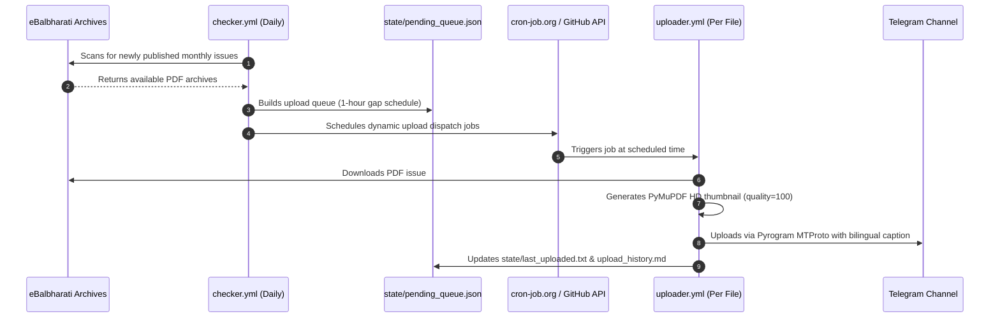

# Kishor Publisher (किशोर पब्लिशर)

> Automated Telegram channel publisher for [Kishor (किशोर) monthly magazine](https://kishor.ebalbharati.in/Archives/) archives published by Balbharati. Automatically detects new issues, schedules 1-hour staggered uploads, generates high-quality cover thumbnails, and publishes each magazine with bilingual metadata.

[](https://github.com/nOneCode4u/kishor-publisher/actions/workflows/checker.yml) [](https://github.com/nOneCode4u/kishor-publisher/actions/workflows/bot.yml) [](https://github.com/nOneCode4u/kishor-publisher/actions/workflows/uploader.yml) [](https://www.python.org/) [](LICENSE) [](https://ko-fi.com/none123)

---

## ⚡ Quick Overview

[](https://kishor.ebalbharati.in/Archives/) [](https://telegram.org/) [-3DDC84?style=for-the-badge&logo=android&logoColor=white)](https://docs.pyrogram.org/) [](https://github.com/nOneCode4u/kishor-publisher/actions) [](https://github.com/nOneCode4u)

---

## 📋 Table of Contents
- [Architecture & Workflow](#-architecture--workflow)
- [Key Features](#-key-features)
- [Repository Structure](#-repository-structure)
- [Setup & Requirements](#-setup--requirements)
- [Telegram Bot Commands](#-telegram-bot-commands)
- [Error Recovery](#-error-recovery)
- [Support & Donations](#-support--donations)
- [License](#-license)

---

## 🏗️ Architecture & Workflow



### Workflow Summary

| Workflow       | Frequency / Trigger                 | Function                                                                                                                                       |
| -------------- | ----------------------------------- | ---------------------------------------------------------------------------------------------------------------------------------------------- |
| `checker.yml`  | Daily at 00:00 UTC (05:30 IST)      | Scans eBalbharati Archives, builds upload queue with 1-hour IST intervals, and creates external cron jobs on cron-job.org.                     |
| `uploader.yml` | Dynamic (repository_dispatch)       | Downloads single PDF issue, renders 100% quality cover thumbnail, verifies SHA-256 integrity, uploads to Telegram Channel, and cleans state.  |
| `bot.yml`      | Every minute (via cron-job.org trigger) | Polls Telegram for owner management commands (`/status`, `/queue`, `/pause`, `/resume`, `/history`).                                            |

---

## 🚀 Key Features

* 📰 **Automated Issue Scraper**: Continuously monitors eBalbharati archives for new and historical issues of Kishor magazine.
* ⏰ **Smart IST Queue Engine**: Automatically schedules uploads starting at `00:00 IST` on day D+1 with a 1-hour gap between consecutive issue uploads.
* 🖼️ **PyMuPDF HD Cover Thumbnails**: Generates uncompressed, high-definition JPEG thumbnails (quality=100) from the first page of each PDF issue.
* ⚡ **Pyrogram MTProto Protocol**: Uploads directly via Telegram User/Bot MTProto client, supporting files up to 2 GB and bypassing Telegram Bot API's 50 MB restriction.
* 🤖 **Interactive Admin Bot**: Full remote control over channel queue and operational state directly from Telegram.
* 🔄 **Smart Disaster Recovery**: Includes `/resume` command which calculates overdue items, re-dispatches pending uploads, and re-establishes missing cron jobs.
* 🔒 **SHA-256 Hash Verification**: Computes and logs cryptographic hashes for every uploaded file inside `state/upload_history.md`.

---

## 📁 Repository Structure

```text
kishor-publisher/
├── .github/
│   ├── FUNDING.yml              # GitHub Sponsors & Ko-fi configuration
│   └── workflows/
│       ├── checker.yml          # Daily issue scanner & queue builder
│       ├── uploader.yml         # Single-file download, thumbnail & MTProto uploader
│       └── bot.yml              # Admin bot Telegram polling workflow
├── scripts/
│   ├── checker.py           # Core scanning & scheduling logic
│   ├── uploader.py          # PDF fetching, rendering & Telegram publication
│   ├── bot.py               # Telegram bot command dispatcher & /resume handler
│   └── utils/
│       ├── cronjob_api.py   # REST API wrapper for cron-job.org dynamic scheduling
│       ├── github_api.py    # GitHub REST API workflow dispatch handler
│       ├── naming.py        # Bilingual Marathi/English title formatting
│       ├── notifications.py # Telegram notification templates
│       ├── state.py         # State I/O, IST time conversions & Git commit helper
│       ├── telegram_client.py  # Pyrogram MTProto uploader interface
│       └── thumbnail.py     # PyMuPDF PDF page renderer
├── state/
│   ├── bot_offset.txt       # Managed Telegram update offset pointer
│   ├── last_uploaded.txt    # Title of last published issue
│   ├── pending_queue.json   # Queue of pending uploads with IST timestamps
│   ├── upload_history.md    # Permanent publication log with SHA-256 checksums
│   └── uploader_status.txt  # System state: 'active' or 'paused'
├── GITHUB_SETTINGS.md       # Metadata guide for repo settings
├── LICENSE                  # MIT License
└── requirements.txt         # Python dependencies
```

---

## ⚙️ Setup & Requirements

### 1. Configure GitHub Secrets
Navigate to **Repo Settings → Secrets and variables → Actions** and add the following:

| Secret Name              | Description                                                                                     |
| ------------------------ | ----------------------------------------------------------------------------------------------- |
| `TELEGRAM_API_ID`        | Telegram API ID from [my.telegram.org](https://my.telegram.org/apps)                            |
| `TELEGRAM_API_HASH`      | Telegram API Hash from [my.telegram.org](https://my.telegram.org/apps)                          |
| `TELEGRAM_BOT_TOKEN`     | Bot Token obtained from [@BotFather](https://t.me/BotFather)                                    |
| `TELEGRAM_OWNER_CHAT_ID` | Your numeric personal Telegram User ID                                                          |
| `TELEGRAM_CHANNEL_ID`    | Target Telegram Channel numeric ID (e.g. `-100123456789`)                                       |
| `GH_PAT`                 | GitHub Personal Access Token with `repo` and `workflow` permissions                             |
| `CRON_JOB_ORG_API_KEY`   | API key from [cron-job.org](https://cron-job.org) (used for scheduling dynamic upload jobs)    |

### 2. Configure External Cron Trigger
Create a recurring 1-minute job on [cron-job.org](https://cron-job.org) pointing to your `bot.yml` workflow trigger endpoint to ensure real-time command processing.

---

## 🤖 Telegram Bot Commands

| Command    | Description                                                     |
| ---------- | --------------------------------------------------------------- |
| `/status`  | Displays operational state, last uploaded issue, and queue size. |
| `/queue`   | Displays full pending upload queue with IST schedule.          |
| `/last`    | Shows detailed metadata of the last published issue.            |
| `/history` | Displays the last 30 entries from `upload_history.md`.           |
| `/pause`   | Pauses automatic issue detection and upload execution.          |
| `/resume`  | Resumes operations, re-enables schedule, and uploads overdue issues. |
| `/help`    | Lists all available commands and system information.            |

---

## 🛠️ Error Recovery

If a network or Telegram API error occurs during publication:
1. The bot dispatches a complete error log & traceback directly to your private chat.
2. Resolve the underlying issue or secret configuration.
3. Send `/resume` to your Telegram bot. The system will automatically recalculate overdue uploads, re-trigger workflow dispatches, and re-create any missing cron jobs.

---

## ☕ Support & Donations

This project is free, open-source, and maintained in free time. If it helped you or your community access Kishor magazine, consider supporting further development:

[](https://ko-fi.com/none123)

*All contributions are completely voluntary and deeply appreciated!* ❤️

---

## 📄 License

Distributed under the [MIT License](LICENSE).
